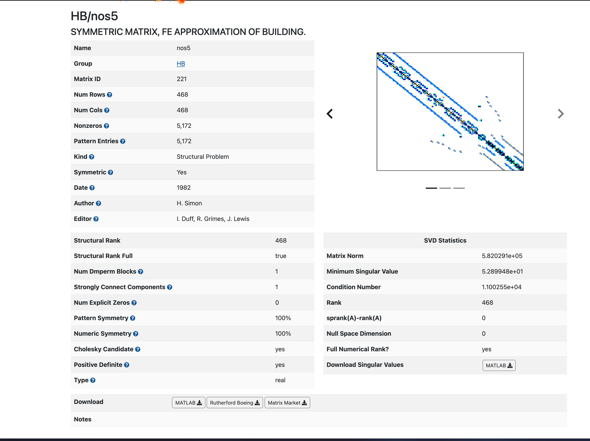

# Matrix Information

以下は SuiteSparse Matrix Collection の行列データ (今回の例では nos5) の情報が書かれているページの内容です. もし実際の画面を見たい場合は画像を参照してください.

- [ ] **名称:** HB/nos5 SYMMETRIC MATRIX, FE APPROXIMATION OF BUILDING.
- [ ] **基本情報**
    - [ ] Name: nos5
    - [ ] Group: HB
    - [ ] Matrix ID: 221
    - [ ] Num Rows: 468
    - [ ] Num Cols: 468
    - [ ] Nonzeros: 5,172
    - [ ] Pattern Entries: 5,172
    - [ ] Kind: Structural Problem
    - [ ] Symmetric: Yes
    - [ ] Date: 1982
    - [ ] Author: H. Simon
    - [ ] Editor: I. Duff, R. Grimes, J. Lewis
- [ ] **構造的情報**
    - [ ] Structural Rank: 468
    - [ ] Structural Rank Full: true
    - [ ] Num Dmperm Blocks: 1
    - [ ] Strongly Connect Components: 1
    - [ ] Num Explicit Zeros: 0
    - [ ] Pattern Symmetry: 100%
    - [ ] Numeric Symmetry: 100%
    - [ ] Cholesky Candidate: yes
    - [ ] Positive Definite: yes
    - [ ] Type: real
- [ ] **SVD統計**
    - [ ] Matrix Norm: 5.820291e+05
    - [ ] Minimum Singular Value: 5.289948e+01
    - [ ] Condition Number: 1.100255e+04
    - [ ] Rank: 468
    - [ ] sprank(A)-rank(A): 0
    - [ ] Null Space Dimension: 0
    - [ ] Full Numerical Rank?: yes
- [ ] **ダウンロード**
    - [ ] 行列データ: MATLAB, Rutherford Boeing, Matrix Market
    - [ ] 特異値データ: MATLAB
- [ ] **可視化**
    - [ ] 行列の構造図 (468 nodes, 2352 edges)
- [ ] **注釈 (Notes)**
    - [ ] (この項目はありますが、画像内では空欄です)

